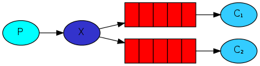
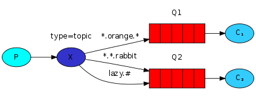

# 参考

- [https://github.com/rabbitmq/rabbitmq-server](https://github.com/rabbitmq/rabbitmq-server)
- [https://www.rabbitmq.com/](https://www.rabbitmq.com/)
- [https://www.rabbitmq.com/getstarted.html](https://www.rabbitmq.com/getstarted.html)
- [https://github.com/streadway/amqp](https://github.com/streadway/amqp)
- [https://github.com/rabbitmq/rabbitmq-tutorials/tree/master/go](https://github.com/rabbitmq/rabbitmq-tutorials/tree/master/go)

## 下载依赖包

```
go get github.com/streadway/amqp
```
## Publish/Subscribe

Sending messages to many consumers at once



## Routing

Receiving messages selectively


## [Topic exchange](https://www.rabbitmq.com/tutorials/tutorial-five-go.html)

Receiving messages based on a pattern (topics)

> Messages sent to a topic exchange can't have an arbitrary routing_key - it must be a list of words, delimited by dots.
The words can be anything, but usually they specify some features connected to the message. 
A few valid routing key examples: "stock.usd.nyse", "nyse.vmw", "quick.orange.rabbit". 
There can be as many words in the routing key as you like, up to the limit of 255 bytes.
> 
> The binding key must also be in the same form. 
The logic behind the topic exchange is similar to a direct one - 
a message sent with a particular routing key will be delivered to all the queues that are bound with a matching binding key. 
However there are two important special cases for binding keys:

```bash
# * (star) can substitute for exactly one word.
# # (hash) can substitute for zero or more words.
```

It's easiest to explain this in an example:



> When a queue is bound with "#" (hash) binding key - 
it will receive all the messages, regardless of the routing key - like in fanout exchange.
> 
> When special characters "*" (star) and "#" (hash) aren't used in bindings, 
the topic exchange will behave just like a direct one.
